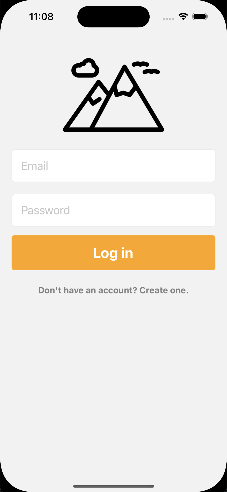

# MTNsnaps

This is a snapchat clone made with Expo Go and React Native.
The back-end is handled with a premade API (http://snapi.epitech.eu:8000)




It is my first React Native application ever !

### Project restrictions
- React Native

### Things I learned making this project
- Mobile app design
- Mobile navigation
- React Native
- Fetching and sending data to an API

### Pre-requisites
Node.js and Expo Go

## Installation
Clone the repo to get started.

Run
```sh
npm install
```
When done, run
```sh
npm run start
```

Either scan the QR Code with your phone or launch an emulator with the chosen device.

Enjoy your snapping!

## License
MIT
